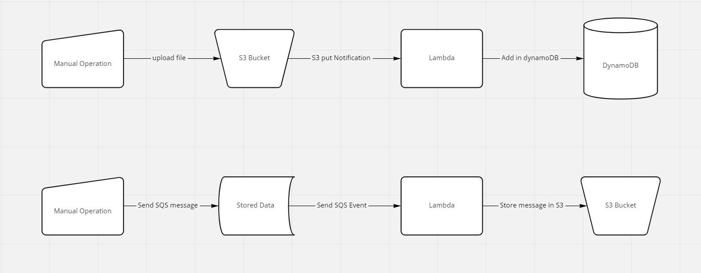

# LocalStack-Demo

**This Tutorial has 2 lambda functions,**
1. **Lambda-1** to read file from S3 bucket and populate the dynamoDB
2. **Lambda-2** to read SQS event and read message body and store it into s3 bucket

**To test the application**

**Build the Project** - 

`mvn clean install`

- Maven shade plugin will create a FAT jar which is required for lambda execution.    
    

1. **Start localstack**
   1. `\localstack\docker-compose up -d`

2. **Goto \localstack\tf**
   1. `terraform init`
   2. `terraform plan`
   3. `terraform apply --auto-approve`

3. **Check that required aws resources are created by terraform**
   1. `aws dynamodb scan --table-name PersonDetails --endpoint-url http://localhost:4566 --region us-east-1`
   2. `aws s3 ls --endpoint-url http://localhost:4566 --region us-east-1`
   3. `aws sqs list-queues --endpoint-url=http://localhost:4566 --region us-east-1`

4. **Test Lambda-1 and Lambda-2**
   1. **Lambda-1** --> It reads json file from S3 and populate data in DynamoDB
      - RUN - `aws dynamodb scan --table-name PersonDetails --endpoint-url http://localhost:4566 --region us-east-1`
        - dynamoDB table PersonDetails is empty.
      - Copy the sample.json to s3 bucket
        - `aws s3 cp sample.json s3://test-bucket/sample.json --endpoint-url http://localhost:4566 --region us-east-1`
      - Wait for few seconds, lambda get executed
      - RUN - `aws dynamodb scan --table-name PersonDetails --endpoint-url http://localhost:4566 --region us-east-1`
        - DynamoDB is now have data populated from sample.json

   2. **Lambda-2** --> read SQS event and read message body and store it into s3 bucket
      - RUN- `aws s3 ls s3://sqsbucket --endpoint-url http://localhost:4566 --region us-east-1`
        - Bucket "sqsbucket" is empty
      - Push the sqs message to sqs 
        - for that, 1st get the URL of sqs, RUN- `aws sqs list-queues --endpoint-url=http://localhost:4566 --region us-east-1`
        - Now send message 
          - RUN - `aws sqs send-message --endpoint-url=http://localhost:4566 --region us-east-1 --queue-url  http://localhost:4566/000000000000/test-sqs --message-body 'Hello, This is test message !!'`
          - **Note** - Pass your SQS URL you got from previous step to --queue-url in above command 
        - Check the bucket "sqsbucket" again 
          - `aws s3 ls s3://sqsbucket --endpoint-url http://localhost:4566 --region us-east-1`
        - Bucket now contains 1 file, if copy that file from S3 to your local machine and open to see its contents,
          - `aws s3 cp s3://sqsbucket/<<file-name>> message.txt --endpoint-url http://localhost:4566 --region us-east-1`
          - open message.txt, it contains **"Hello, This is test message !!"**
